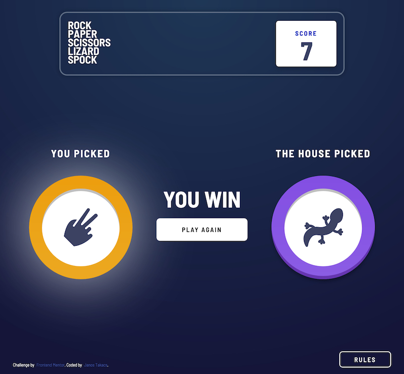

# Frontend Mentor - Rock, Paper, Scissors solution

This is a solution to the [Rock, Paper, Scissors challenge on Frontend Mentor](https://www.frontendmentor.io/challenges/rock-paper-scissors-game-pTgwgvgH). Frontend Mentor challenges help you improve your coding skills by building realistic projects.

## Table of contents

-   [Overview](#overview)
    -   [The challenge](#the-challenge)
    -   [Screenshot](#screenshot)
    -   [Links](#links)
-   [My process](#my-process)
    -   [Built with](#built-with)
    -   [What I learned](#what-i-learned)
    -   [Continued development](#continued-development)
    -   [Useful resources](#useful-resources)
-   [Author](#author)

## Overview

### The challenge

Users should be able to:

-   View the optimal layout for the game depending on their device's screen size
-   Play Rock, Paper, Scissors against the computer
-   Maintain the state of the score after refreshing the browser _(optional)_
-   **Bonus**: Play Rock, Paper, Scissors, Lizard, Spock against the computer _(optional)_

### Screenshot



### Links

-   Solution URL: [source code on GitHub](https://github.com/JT1974/rock-paper-scissors/)
-   Live Site URL: [play the game!](https://jt1974.github.io/rock-paper-scissors/)

## My process

### Built with

-   Semantic HTML5 markup
-   CSS custom properties
-   Flexbox
-   CSS Grid
-   Mobile-first workflow
-   [React](https://reactjs.org/) - JS library
-   [Styled Components](https://styled-components.com/) - For styles

### What I learned

I have not created any styled components since I had Ania Kubów's 'Learn Styled Components in React' course on Scrimba, so I had to refresh my knowledge. Her course is great, but styled-components.com is also a great rescource. Not too difficult, but props passing and nesting can be tricky, so I needed help.

```js
const Button = styled.div`
	width: 100px;
	height: 100px;
	border-radius: 50%;
	display: flex;
	place-content: center;
	align-items: center;
	z-index: 1;

	${({ hand }) =>
		hand === 'scissors' &&
		css`
			background: linear-gradient(180deg, hsl(39, 89%, 49%) 0%, hsl(40, 84%, 53%) 100%);
			box-shadow: 0 0.4em 0.4em hsla(0, 0%, 0%, 0.25), inset 0 -0.5em 0 hsla(28, 75%, 44%, 0.7);
		`};
`
```

### Continued development

Although I've been using it daily, I still spent too much time playing with css (mainly positioning - flex/grid). I need a lot of practice (and more Kevin Powell videos), so I have to work on more Frontend Mentor challenges.

I have to practice building styled components, mainly focusing on passing/using props.

I wasted quite a lot of time setting up my first GitHub pages website (this one), and had to work through some tough (for me at least) issues (e.g. accessing the images after building the page, using gh-pages). I could figure that one out, but I have to dive in to that to avoid this frustrating issue in the future.

### Useful resources

-   CODING MADE SIMPLE (Mosh Hamedani) - [How to use localStorage with React](https://programmingwithmosh.com/react/localstorage-react/)

-   styled-components.com - [Styled Components](https://styled-components.com/)

-   Scrimba (Ania Kubów) - [Learn Styled Components in React](https://scrimba.com/learn/styledcomponents)

-   [gh-pages (npm)](https://www.npmjs.com/package/gh-pages)

## Author

-   Website - [Janos Takacs](https://github.com/JT1974)
-   Frontend Mentor - [@JT1974](https://www.frontendmentor.io/profile/JT1974)
-   Twitter - [@TakacsJanos7](https://twitter.com/TakacsJanos7)

